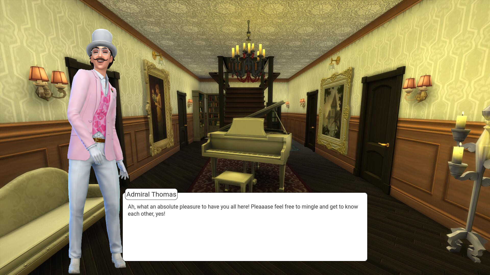

# No Time to Stalk

No Time to Stalk is a murder-mystery visual novel game created for the [Pridetharian Jam 2021](https://itch.io/jam/pridetharian21).

It is implemented as a web app running a custom engine, written in TypeScript with Svelte and Express.

Please be advised that the game contains some potentially stressful scenes.
If you think you may be affected, please read through the [content warnings](CONTENT.md)

